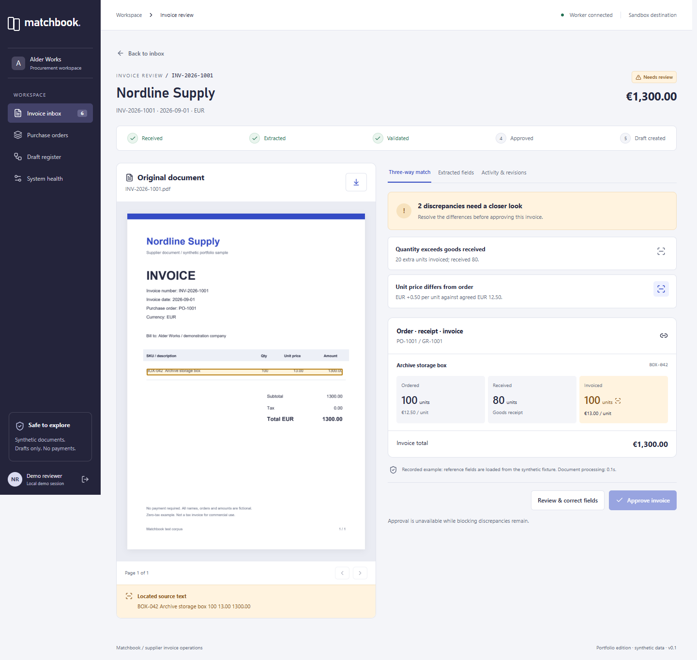
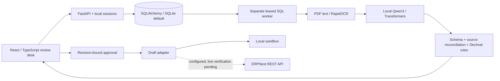

# Matchbook

[](https://github.com/barchenkoN/matchbook-ai-invoice-review/actions/workflows/ci.yml)

**Local-first AI-assisted invoice review with deterministic controls, human approval, and an auditable decision trail.**

Matchbook extracts an invoice, checks it against a purchase order and goods receipt, requires a human to approve the current revision, and creates a draft in an explicitly labelled local sandbox. It runs on Windows without paid API credentials. A separate ERPNext REST adapter is implemented and contract-tested; **a live ERPNext deployment has not been verified**.



## Try it

On the prepared machine, double-click **Start-Matchbook.cmd**, or run:

```powershell
./start.ps1
```

Open **http://127.0.0.1:8787** and enter the demo reviewer workspace. Keep the launcher window open. `Ctrl+C` stops services started by that launcher. It binds to loopback, not the public network.

For a fresh Windows checkout with Python 3.12+:

```powershell
./setup.ps1
./start.ps1 -WithoutAI
```

The committed frontend build and six recorded examples make the interface usable without Node, Docker or model downloads. **Recorded examples are reference fixtures, not AI inference.** To process new documents with the optional local model:

```powershell
./setup.ps1 -WithAI
./start.ps1
```

This installs CPU PyTorch/Transformers and downloads Qwen3 model data. Initial downloads require internet; subsequent inference is local. No vendor API key is used. The model is small and imperfect; the review and validation layers are intentional product features.

## A two-minute review

1. Open **INV-2026-1001** from Nordline Supply. The order is 100 units at €12.50; the receipt confirms 80; the invoice asks for 100 at €13.00.
2. Inspect the quantity and price differences. Click the source icon to highlight the corresponding row in the original document. Approval stays disabled.
3. Open **INV-2026-1002** (or another matched example if it already has a draft). Review, approve, and explicitly confirm **Create draft**.
4. Open **Draft register** to inspect the persisted sandbox record. No accounting entry or payment was made.
5. Inspect **Activity & revisions**, export the evidence JSON, and open **System health** to see actual service status and limitations.

## Engineering substance

- **Real document processing:** PDF text with coordinates using pdfplumber; image/scanned-page OCR using RapidOCR ONNX; rendered source pages using PDFium.
- **Real local inference:** Qwen3 0.6B Q8 GGUF weights loaded and dequantized to float32 in Transformers/PyTorch on CPU. This runtime does post-generation schema validation, not grammar-constrained decoding.
- **Hybrid extraction:** unambiguous, explicitly printed totals and numeric table cells can correct a model candidate. Every correction is recorded; the raw model response remains stored separately. The system never changes the printed invoice to make its arithmetic pass.
- **Deterministic rules:** Decimal arithmetic, supplier/currency checks, purchase-order prices, received quantity limits, source grounding and duplicate invoice checks.
- **Controlled state:** immutable revision history, optimistic version checks, approval invalidation on edit, unique order allocation, viewer/reviewer authorization, same-origin mutation checks.
- **Durable execution:** SQL jobs with atomic claims, leases and crash recovery. Expired extraction jobs can be recovered. A potentially committed remote write moves to `sync_uncertain` and is reconciled; it is not blindly repeated.
- **Integration boundary:** an idempotent local draft sandbox plus an ERPNext REST adapter with draft-only POST, import reference, read-back checks and read-only reconciliation.
- **Operational evidence:** real browser workflow checks, regression tests, a development model spike, OCR output, and a separate synthetic held-out evaluation with raw-model and pipeline results.

## Architecture



The Windows-first implementation deliberately differs from the initial concept: RapidOCR/PDFium replace Docling; a leased SQL queue replaces Celery/Redis; SQLite is the verified default. PostgreSQL is configurable through SQLAlchemy but has not been exercised here. These distinctions matter when describing the project in a CV.

## Verification and limits

See [verification evidence](docs/VERIFICATION.md), [evaluation results](docs/evidence/heldout-evaluation.json), [architecture decisions](docs/ARCHITECTURE.md), and [runbook](docs/RUNBOOK.md).

The 60-document corpus is synthetic. Its held-out split contains 24 documents from two supplier layouts, but the tables are simple and structurally similar. Results **do not establish real-world document accuracy**. Handwriting, arbitrary languages, tax policy, FX, multiple receipt allocations and repeated billing are outside v1. No production customers, savings, compliance certification or commercial AI experience are claimed.

Demo roles make review convenient; they are not an identity system. Set `MATCHBOOK_DEMO_AUTH=0` and locally configured viewer/reviewer passwords for password-protected local use. This remains a local portfolio build, not a hardened public SaaS.

## Development

```powershell
./.venv/Scripts/python.exe -m pip install -r requirements-dev.txt
./.venv/Scripts/python.exe -m pytest -q
./.venv/Scripts/python.exe -m ruff check app tools tests
pnpm --dir frontend install
pnpm --dir frontend run build
./.venv/Scripts/python.exe -m tools.browser_check
```

Browser checks use installed Chrome and Playwright; video recording also requires `python -m playwright install ffmpeg`. The current browser script expects the six seeded examples and creates one sandbox draft. Run it against a disposable demo database, not personal documents.

`python -m tools.evaluate` runs the held-out model evaluation and overwrites its report. Do not tune on those results and keep calling the same set unseen. `python -m tools.batch_intake <folder>` demonstrates HTTP-only batch submission.

## Repository guide

| Location | Purpose |
|---|---|
| `app/domain.py` | Invoice schema and model-independent checks |
| `app/extraction.py` | PDF/OCR, model client, evidence and source reconciliation |
| `app/service.py` | Intake, revisions, approval and sync state transitions |
| `app/db.py`, `app/worker.py` | Relational persistence, job claims and recovery |
| `app/erp.py` | Explicit sandbox and ERPNext adapters |
| `frontend/src/` | React/TypeScript UI and shared primitives |
| `fixtures/` | Reproducible synthetic PDFs and ground truth |
| `tests/` | Workflow, safety boundaries, concurrency and adapter contracts |
| `docs/` | Architecture, verification evidence, screenshots and demo guidance |

An optional [n8n digest workflow](workflows/n8n-review-digest.json) is supplied as an **unexecuted integration example**. It is read-only, uses local demo authentication and sends no external messages. Change the base URL for Docker networking; `127.0.0.1` inside a container is not the host.

## Attribution

Uses [Qwen3](https://huggingface.co/Qwen/Qwen3-0.6B) and [Qwen GGUF weights](https://huggingface.co/Qwen/Qwen3-0.6B-GGUF), [Transformers](https://github.com/huggingface/transformers), [RapidOCR](https://github.com/RapidAI/RapidOCR), and the [Frappe REST API](https://docs.frappe.io/framework/user/en/api/rest). Their respective licenses apply. Model weights and installed runtimes are not included in the shareable project ZIP.

AI coding tools supported implementation and review. The repository keeps deterministic business rules, automated tests, evaluation evidence and explicit system limitations visible so the resulting behavior can be inspected rather than taken on trust.
